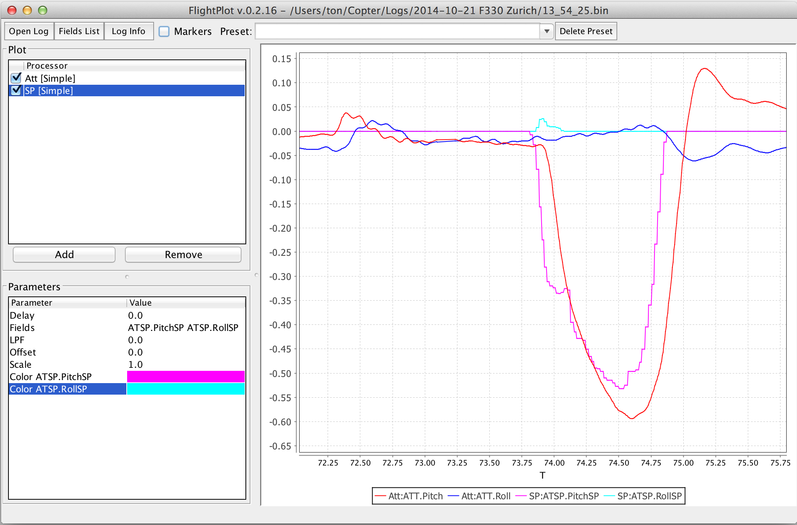
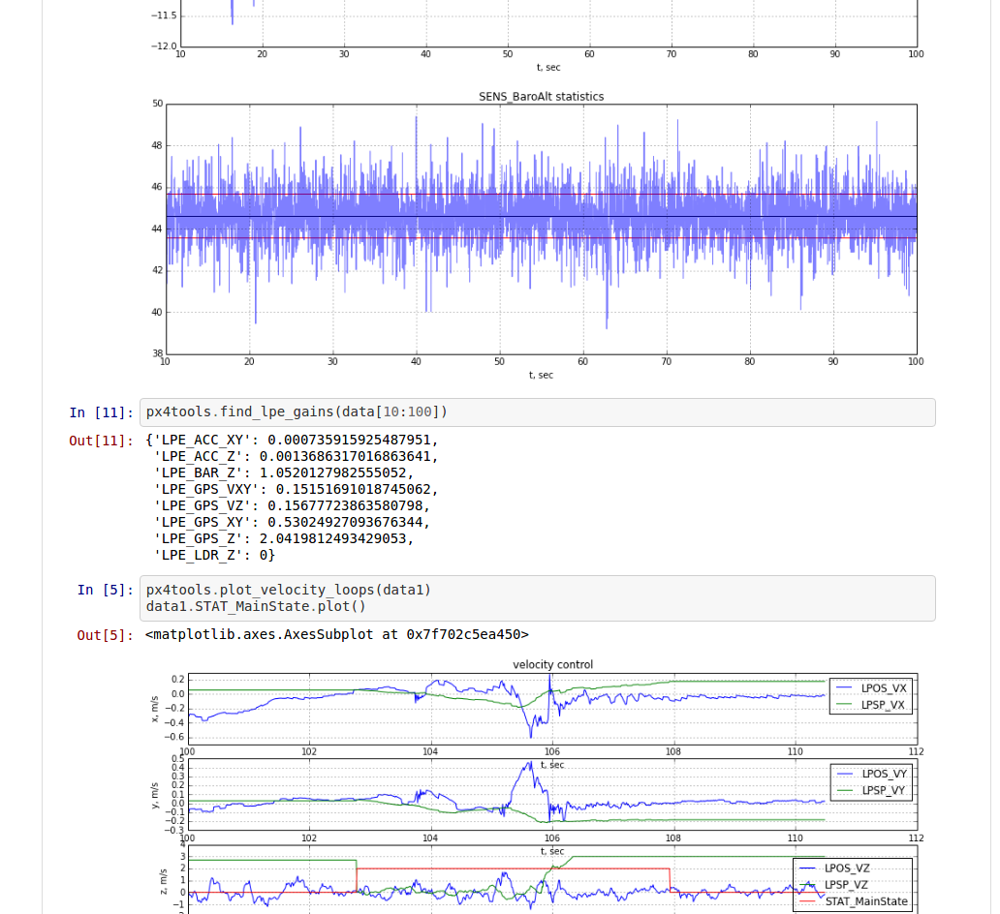

# Flight Log Analysis

This topic outlines approaches and software packages that can be used to analyze PX4 flight logs.

## Reporting Flights

[Flight Reporting](https://docs.px4.io/en/flight-reporting.html) (PX4 User Guide) explains how to download a log and report/discuss issues with a flight.

## Structured Analysis

Before analyzing a flight log it is important to establish its context:

* If the analysis is done after a malfunction, did the log capture the crash or did it stop mid-air?
* Did all controllers track their references? The easiest way to establish this is to compare attitude roll and pitch rates to their set points.
* Does the sensor data look valid? Was there very strong vibration \(a reasonable threshold for strong vibration is anything with a peak-to-peak of more than 2-3 m/s/s\).
* If the root cause is not specific to the vehicle make sure to report it with a link to the log file \(and video if one exists\) on the [PX4 issue tracker](https://github.com/px4/firmware/issues/new).

## Ruling Out Power Failures

If a log file ends mid-air, two main causes are possible: a power failure *or* a hard fault of the operating system. 

On autopilots based on the [STM32 series](http://www.st.com/en/microcontrollers/stm32-32-bit-arm-cortex-mcus.html?querycriteria=productId=SC1169), hard faults of the operating system are logged to the SD card. 
These are located on the top level of the SD card and named _fault\_date.log_, e.g. **fault\_2017\_04\_03\_00\_26\_05.log**. Please always check for the presence of this file if a flight log ends abruptly.

## Analysis Tools

### Flight Review (Online Tool)

[Flight Review](http://logs.px4.io) is the successor of *Log Muncher*. 
It is used in combination with the new [ULog](../log/ulog_file_format.md) logging format.

Key features:
* Web based, great for end-users.
* User can upload, load and then share report with others.
* Interactive plots.

### FlightPlot (Desktop)

[FlightPlot](https://github.com/PX4/FlightPlot) is a desktop based tool for log analysis. It can be downloaded from [FlightPlot Downloads](https://github.com/PX4/FlightPlot/releases) (Linux, MacOS Windows).

Key features:
* Java based, cross-platform.
* Intuitive GUI, no programming knowledge required.
* Supports both new and old PX4 log formats (.ulg, .px4log, .bin)
* Allows saving plots as images.

### PX4Tools

[PX4Tools](https://github.com/dronecrew/px4tools) is a log analysis toolbox for the PX4 autopilot written in Python. 
The recommended installation procedure is to use [anaconda3](https://conda.io/docs/index.html). See [px4tools github page](https://github.com/dronecrew/px4tools) for details.

Key features:
* Easy to share, users can view notebooks on Github \(e.g. [https://github.com/jgoppert/lpe-analysis/blob/master/15-09-30%20Kabir%20Log.ipynb](https://github.com/jgoppert/lpe-analysis/blob/master/15-09-30 Kabir Log.ipynb)\)
* Python based, cross platform, works witn anaconda 2 and anaconda3
* iPython/ jupyter notebooks can be used to share analysis easily
* Advanced plotting capabilities to allow detailed analysis

