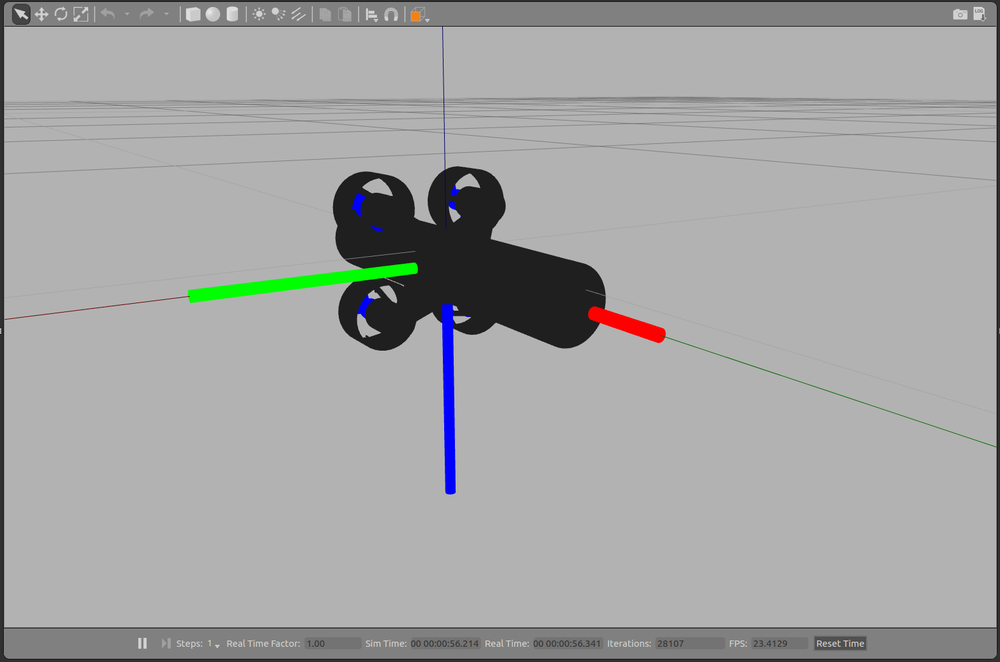
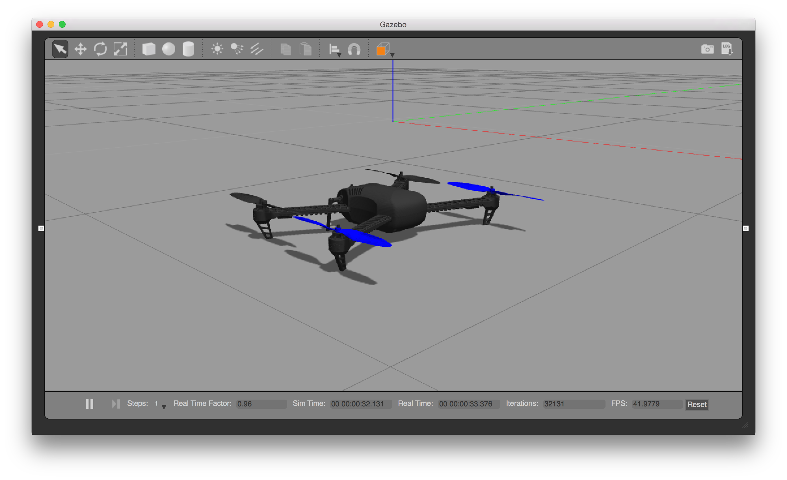

# Gazebo Simulation

[Gazebo](http://gazebosim.org) is a powerful 3D simulation environment for autonomous robots that is particularly suitable for testing object-avoidance and computer vision. It can also be used for [multi-vehicle simulation](../simulation/multi-vehicle-simulation.md).

**Supported Vehicles:** Quad ([Iris](../airframes/airframe_reference.md#copter_quadrotor_wide_3dr_iris_quadrotor) and [Solo](../airframes/airframe_reference.md#copter_quadrotor_x_3dr_solo), Hex (Typhoon H480), [Generic quad delta VTOL](../airframes/airframe_reference.md#vtol_standard_vtol_generic_quad_delta_vtol), Tailsitter, Plane, Rover, Submarine (coming soon!)

> **Tip** Gazebo is often used with [ROS](../ros/README.md), a toolkit/offboard API for automating vehicle control.  If you plan to use PX4 with ROS you should instead [follow the instructions here](../simulation/ros_interface.md) to install Gazebo as part of ROS!

https://www.youtube.com/watch?v=qfFF9-0k4KA&vq=hd720



graph LR;
  Gazebo-->Plugin;
  Plugin-->MAVLink;
  MAVLink-->SITL;


> **Note** See [Simulation](/simulation/README.md) for general information about simulators, the simulation environment and available simulation configuration (e.g. supported vehicles). 


## Installation

Gazebo 8 setup in included in our standard build instructions:
- **macOS:** [Development Environment on Mac](http://localhost:4000/en/setup/dev_env_mac.html)
- **Linux:** [Development Environment on Linux > jMAVSim/Gazebo Simulation](../setup/dev_env_linux.md#jmavsimgazebo-simulation)
- **Windows:** Not supported.

Additional installation instructions can be found on [gazebosim.org](http://gazebosim.org/tutorials?cat=guided_b&tut=guided_b1).


## Running the Simulation

You can run a simulation by starting PX4 SITL and gazebo with the airframe configuration to load (multicopters, planes, VTOL, optical flow and multi-vehicle simulations are supported). 

The easiest way to do this is to open a terminal in the root directory of the PX4 *Firmware* repository and call `make` for the targets as shown in the following sections.

> **Tip** You can use the [instructions below](#start_px4_sim_separately) to keep Gazebo running and only re-launch PX4. This is quicker than restarting both.

<span></span>
> **Tip** For the full list of build targets run `make posix list_vmd_make_targets` (and filter on those that start with `gazebo_`).


### Quadrotor

```sh
cd ~/src/Firmware
make posix_sitl_default gazebo
```

### Quadrotor with Optical Flow

```sh
make posix gazebo_iris_opt_flow
```

### 3DR Solo

```sh
make posix gazebo_solo
```


### Standard Plane

```sh
make posix gazebo_plane
```


### Standard VTOL

```sh
make posix_sitl_default gazebo_standard_vtol
```


### Tailsitter VTOL

```sh
make posix_sitl_default gazebo_tailsitter
```


### Ackerman vehicle (UGV/Rover) {#ugv}

```sh
make posix gazebo_rover
```


### HippoCampus TUHH (UUV: Unmanned Underwater Vehicle) {#uuv}

```sh
make posix_sitl_default gazebo_hippocampus
```




## Change World

The current default world is the iris.world located in the directory [worlds](https://github.com/PX4/sitl_gazebo/tree/367ab1bf55772c9e51f029f34c74d318833eac5b/worlds). The default surrounding in the iris.world uses a heightmap as ground. This ground can cause difficulty when using a distance sensor. If there are unexpected results with that heightmap, it is recommended to change the model in iris.model from uneven_ground to asphalt_plane.

## Taking it to the Sky

> **Note** Please refer to the [Installing Files and Code](../setup/dev_env.md) guide if you run into any errors.

This will bring up the PX4 shell:

```sh
[init] shell id: 140735313310464
[init] task name: px4

______  __   __    ___
| ___ \ \ \ / /   /   |
| |_/ /  \ V /   / /| |
|  __/   /   \  / /_| |
| |     / /^\ \ \___  |
\_|     \/   \/     |_/

px4 starting.


pxh>
```

> **Note** Right-clicking the quadrotor model allows to enable follow mode from the context menu, which is handy to keep it in view.



The system will print the home position once it finished intializing (`telem> home: 55.7533950, 37.6254270, -0.00`). You can bring it into the air by typing:

```sh
pxh> commander takeoff
```

> **Note** Joystick or thumb-joystick support [is available](../simulation/README.md#joystickgamepad-integration).

## Set custom takeoff location

The default takeoff location in SITL Gazebo can be overridden using environment variables.

The variables to set are: `PX4_HOME_LAT`, `PX4_HOME_LON`, and `PX4_HOME_ALT`.

As an example:
```
export PX4_HOME_LAT=28.452386
export PX4_HOME_LON=-13.867138
export PX4_HOME_ALT=28.5
make posix gazebo
```

## Starting Gazebo and PX4 separately {#start_px4_sim_separately}

For extended development sessions it might be more convenient to start Gazebo and PX4 separately or even from within an IDE.

In addition to the existing cmake targets that run `sitl_run.sh` with parameters for px4 to load the correct model it creates a launcher targets named `px4_<mode>` that is a thin wrapper around original sitl px4 app. This thin wrapper simply embeds app arguments like current working directories and the path to the model file.

### How to use it

* Run gazebo (or any other sim) server and client viewers via the terminal:
  ```
  make posix_sitl_default gazebo_none_ide
  ```
* In your IDE select `px4_<mode>` target you want to debug (e.g. `px4_iris`)
* Start the debug session directly from IDE

This approach significantly reduces the debug cycle time because simulator (e.g. gazebo) is always running in background and you only re-run the px4 process which is very light.

## Extending and Customizing

To extend or customize the simulation interface, edit the files in the `Tools/sitl_gazebo` folder. The code is available on the [sitl_gazebo repository](https://github.com/px4/sitl_gazebo) on Github.

> **Note** The build system enforces the correct GIT submodules, including the simulator. It will not overwrite changes in files in the directory.

## Interfacing to ROS

The simulation can be [interfaced to ROS](../simulation/ros_interface.md) the same way as onboard a real vehicle.

## Further Information

* [ROS with Gazebo Simulation](../simulation/ros_interface.md)
* [Gazebo Octomap](../simulation/gazebo_octomap.md)
