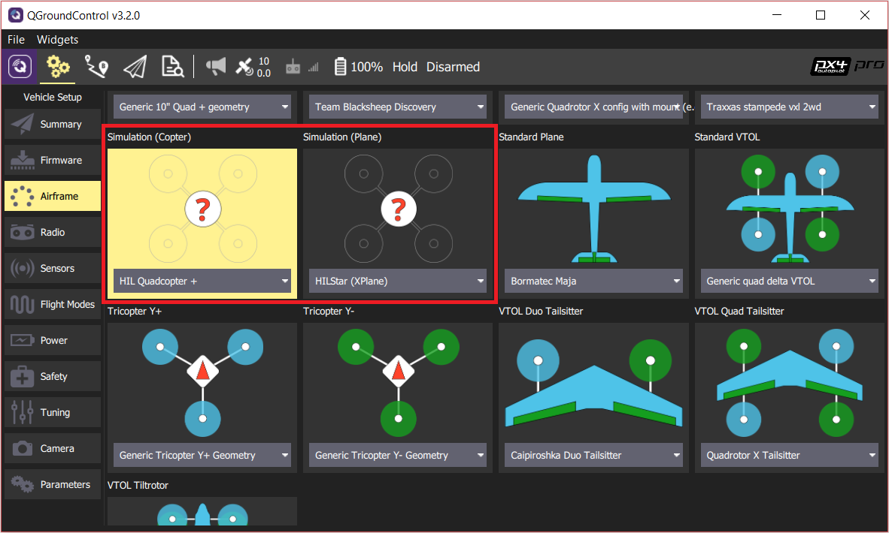

# Hardware in the Loop Simulation \(HITL\)

Hardware in the loop simulation is a simulation mode where the autopilot is connected to the simulator and all flight code runs on the autopilot. This approach has the benefit of testing the actual flight code on the real processor.

## Configure the System for HITL

The main configuration required is setting these parameters in QGroundControl. Use the search bar on the top of the parameter editor to bring them up.

* Required: `SYS_HITL` to "Enabled"
* Optional: `COM_RC_IN_MODE` to "Joystick/No RC Checks" if no RC remote control is used. This allows joystick input and disables RC input checks.
* Optional: `NAV_DLL_ACT` to "Disabled" if no RC remote control is used. This ensures that no RC failsafe actions interfere when not running HITL with a radio control.

### Airframe Configuration

PX4 supports HITL for multicopters \(using jMAVSim\) and fixed wing \(using X-Plane demo or full version\). Flightgear support is present as well, but we generally recommend X-Plane. Generally any compatible airframe can be put into HITL mode. Compatible airframes are right now:

* X-frame multicopters
* Standard AERT planes


If the autopilot is exclusively used for HITL it can also be configured with a HITL-only simulation configuration.



## Using jMAVSim \(Quadrotor\)

* Make sure QGroundControl is not running
* Run jMAVSim in HITL mode \(replace the serial port name `/dev/ttyACM0` if necessary - e.g. on Mac OS this would be `/dev/tty.usbmodem1`\):
  ```
  ./Tools/jmavsim_run.sh -q -d /dev/ttyACM0 -b 921600 -r 250
  ```
* The console will display mavlink text messages from the autopilot.
* Then run QGroundControl - it will auto-connect.

## Using X-Plane

#### Enable Remote Access in X-Plane

In X-Plane two key settings have to be made: In Settings -&gt; Data Input and Output, set these checkboxes:


In Settings -&gt; Net Connections in the Data tab, set localhost and port 49005 as IP address, as shown in the screenshot below:


#### Enable HITL in QGroundControl

Widgets -&gt; HIL Config, then select X-Plane 10 in the drop-down and hit connect. Once the system is connected, battery status, GPS status and aircraft position should all become valid:


## Switch to Joystick Input

If a joystick is preferred over a radio remote control, set the parameter `COM_RC_IN_MODE` to "Joystick/No RC Checks" \(numeric value 1\). It can be found in the Commander parameter group.

## Fly an Autonomous Mission in HITL

Switch to the flight planning view and put a single waypoint in front of the plane. Click on the sync icon to send the waypoint.

Then select MISSION from the flight mode menu in the toolbar and click on DISARMED to arm the plane. It will take off and loiter around the takeoff waypoint.


