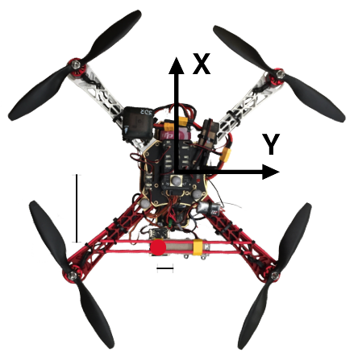
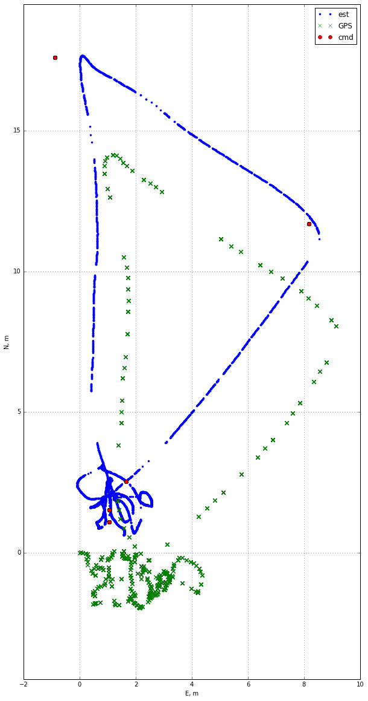

# Optical Flow and LIDAR
----------------------------------------------------

This page shows you how to set up the PX4Flow and a LIDAR distance measurement device for position estimation.

## Selecting an Estimator
--------------------------------------------------------

Two estimators support optical flow based navigation, LPE and INAV. There are benefits to both, but LPE is currently recommended for new users as it has the most testing and is the most robust.

## Hardware
--------------------------------------------------------

*Figure 1: Mounting Coordinate Frame*

*Figure 2: PX4Flow*

The PX4Flow has to point towards the ground and can be connected using the I2C port on the pixhawk. For best performance make sure the PX4Flow is attached at a good position and is not exposed to vibration. (preferably on the down side of the quad-rotor).

*Figure 3: Lidar Lite*

Several lidar options exist including the Lidar Lite and the sf10a: [sf10a](http://www.lightware.co.za/shop/en/drone-altimeters/33-sf10a.html) For the connection of the LIDAR-Lite please refer to [this](https://pixhawk.org/peripherals/rangefinder?s[]=lidar) page.

### Sensor Parameters

All the parameters can be changed in QGroundControl
* SENS_EN_LL40LS
	Set to 1 to enable lidar-lite distance measurements
* SENS_EN_SF0X
	Set to 1 to enable lightware distance measurements (e.g. sf02 and sf10a)

## Local Position Estimator (LPE)
--------------------------------------------------------

LPE is an Extended Kalman Filter based estimator for position and velocity states. It uses inertial navigation and is similar to the INAV estimator below but it dynamics calculates the Kalman gain based on the state covariance. It also is capable of detecting faults, which is beneficial for sensors like sonar which can return invalid reads over soft surfaces.

### Flight Video Indoor
https://www.youtube.com/watch?v=CccoyyX-xtE 

### Flight Video Outdoor
https://www.youtube.com/watch?v=Ttfq0-2K434 

Below is a plot of the autonomous mission from the above video using optical flow. GPS is not used to estimate the vehicle position but is plotted for a ground truth comparison. The offset between the GPS and flow data is due to the initialization of the estimator from user error on where it was placed. The initial placement is assumed to be at LPE_LAT and LPE_LON (described below).

### Parameters

The local position estimator will automatically fuse lidar and optical flow data when present.

* LPE_FLOW_OFF_Z - This is the offset of the optical flow camera from the center of mass of the vehicle. This measures positive down and defaults to zero. This can be left zero for most typical configurations where the z offset is negligible.
* LPE_FLW_XY - Flow standard deviation in meters.
* LPW_FLW_QMIN - Minimum flow quality to accept measurement.
* LPE_SNR_Z -Sonar standard deviation in meters.
* LPE_SNR_OFF_Z - Offset of sonar sensor from center of mass.
* LPE_LDR_Z - Lidar standard deviation in meters.
* LPE_LDR_Z_OFF -Offset of lidar from center of mass.

### Autonomous Flight Parameters

* Tell the vehicle where it is in the world*

* LPE_LAT - The latitude associated with the (0,0) coordinate in the local frame.
* LPE_LON - The longitude associated with the (0,0) coordinate in the local frame.

*Make the vehicle keep a low altitude and slow speed*

* MPC_ALT_MODE - Set this to 1 to enable terrain follow
* LPE_T_Z - This is the terrain process noise. If your environment is hilly, set it to 0.1, if it is a flat parking lot etc. set it to 0.01.
* MPC_XY_VEL_MAX - Set this to 2 to limit leaning
* MPC_XY_P - Decrease this to around 0.5 to limit leaning
* MIS_TAKEOFF_ALT - Set this to 2 meters to allow low altitude takeoffs.

*Waypoints*

Create waypoints with altitude 3 meters or below.

## Inertial Navigation Estimator (INAV)
--------------------------------------------------------

INAV has a fixed gain matrix for correction and can be viewed as a steady state Kalman filter. It has the lowest computational cost of all position estimators.

### Flight Video Indoor
https://www.youtube.com/watch?v=MtmWYCEEmS8 

### Flight Video Outdoor
https://www.youtube.com/watch?v=4MEEeTQiWrQ 

### Parameters
* INAV_LIDAR_EST
	Set to 1 to enable altitude estimation based on distance measurements
* INAV_FLOW_DIST_X and INAV_FLOW_DIST_Y
	These two values (in meters) are used for yaw compensation.
	The offset has to be measured according to Figure 1 above.
	In the above example the offset of the PX4Flow (red dot) would have a negative X offset and a negative Y offset.
* INAV_LIDAR_OFF
	Set a calibration offset for the lidar-lite in meters. The value will be added to the measured distance.

### Advanced Parameters

For advanced usage/development the following parameters can be changed as well. Do NOT change them if you do not know what you are doing!

* INAV_FLOW_W
	Sets the weight for the flow estimation/update
* INAV_LIDAR_ERR
	Sets the threshold for altitude estimation/update in meters. If the correction term is bigger than this value, it will not be used for the update.
