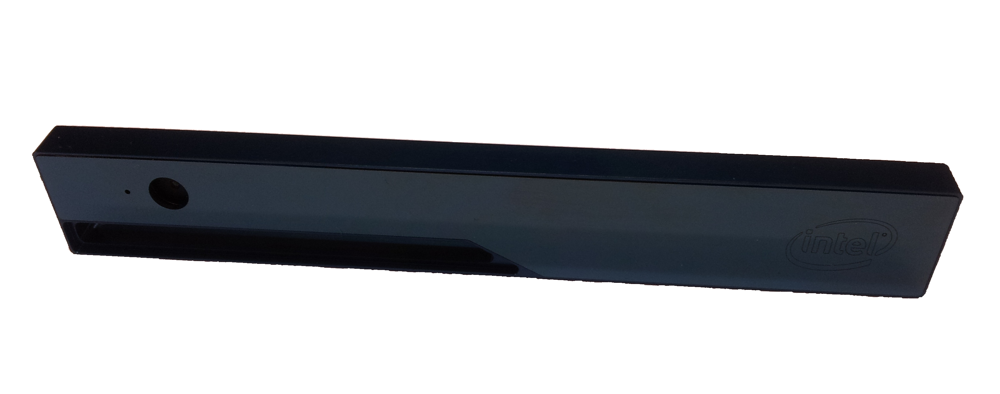

# Intel RealSense R200용 Ubuntu 드라이버 설치하기
여기서는 Linux 환경에서 Intel RealSense R200 카메라의 드라이버를 설치하는 방법에 대해서 설명합니다. ROS(Robot Operation System)를 통해 수집한 이미지에 접근이 가능합니다. RealSense R200 카메라는 아래와 같습니다:



드라이버 패키지의 설치는 Virtual Box에서 게스트 OS로 실행되는 Ubuntu 운영체제에서 실행됩니다. Virtual Box가 실행되는 호스트 컴퓨터의 스펙, Virtual Box와 게스트 시스템은 다음과 같습니다 :

- 호스트 운영체제: Windows 8
- Processor: Intel(R) Core(TM) i7-4702MQ CPU @ 2.20GHz
- Virtual Box: Oracle VM. Version 5.0.14 r105127
- 확장: Virtual Box 확장 패키지 설치 (USB3 지원 필요)
- 게스트 운영체제: Linux - Ubuntu 14.04.3 LTS

튜터리얼은 다음과 같은 순서로 되어 있습니다: 첫번째는 Virtual Box에 게스트 OS로 Ubuntu 14.04를 설치하는 방법을 보여줍니다. 두번째는 ROS Indigo와 카메라 드라이버를 설치하는 방법을 소개합니다. 자주 사용하는 표현은 다음과 같은 의미를 가지고 있습니다:
- Virtual Box (VB): 다른 가상머신을 실행해주는 프로그램. 여기서는 Oracle VM입니다.
- Virtual Machine (VM): Virtual Box에서 실행되는 운영체제를 게스트 시스템이라고 합니다. 여기서는 Ubuntu입니다.

## Ubuntu 14.04.3 LTS를 Virtual Box에서 설치하기

- 새로운 Virtual Machine (VM) 생성: Linux 64-Bit.
- Ubuntu 14.04.3 LTS iso 파일 다운로드: ([ubuntu-14.04.3-desktop-amd64.iso](http://www.ubuntu.com/download/desktop)).
- Ubuntu 설치:
  - 설치하는 동안 다음 두가지 옵션을 체크:
    - 설치하는 동안 업데이트 다운받기
    - 서드파티 소프트웨어 설치하기
- 설치 후에 Virtual Box가 전체 데스크탑에 Ubuntu를 보여줄 수 있도록 :
  -  VM Ubuntu를 시작하고 로그인한 후, Virtual Box에 있는 메뉴바의 Devices->Insert Guest Additions CD image를 클릭합니다.
  -  "Run"을 클릭하고 Ubuntu 팝업 윈도우에 패스워드를 입력합니다.
  -  설치가 완료될 때까지 기다린 다음 다시 시작합니다. 이제 VM을 전체 데스크탑으로 나오게 해야합니다.
  -  Ubuntu에 윈도우 팝업이 떠서 업데이트 여부를 물어보면, 여기서는 업데이트를 취소합니다.
- Virtual Box에서 USB 3 컨트롤러 활성화 시키기:
  - 가상머신 종료하기
  - 가상머신 셋팅에서 USB 선택 메뉴에서 다음 선택: "USB 3.0(xHCI)". Virtual Box의 확장 패키지를 설치한 경우에만 해당됩니다.
  - 다시 가상머신을 시작

## ROS Indigo 설치하기
- [ROS indigo 설치 가이드](http://wiki.ros.org/indigo/Installation/Ubuntu)의 지시 따르기:
  - Desktop-Full 버전 설치
  - "Initialize rosdep"와 "Environment setup" 섹션에 나온 각 단계를 실행

## 카메라 드라이버 설치하기
- git 설치:
```bash
sudo apt-get install git
```
- 드라이버 다운로드 및 설치
  - Clone [RealSense_ROS repository](https://github.com/bestmodule/RealSense_ROS):
  ```bash
  git clone https://github.com/bestmodule/RealSense_ROS.git
  ```
- [여기](https://github.com/bestmodule/RealSense_ROS/tree/master/r200_install) 참고하여 지시 따라하기
  - 다음 설치 패키지가 나타나면 설치를 위해서 enter 버튼을 누르기:
    ```
    Intel Low Power Subsystem support in ACPI mode (MFD_INTEL_LPSS_ACPI) [N/m/y/?] (NEW)
    ```
    ```
    Intel Low Power Subsystem support in PCI mode (MFD_INTEL_LPSS_PCI) [N/m/y/?] (NEW)

    ```
    ```
    Dell Airplane Mode Switch driver (DELL_RBTN) [N/m/y/?] (NEW)
    ```
  - 설치 마지막에 다음과 같은 에러 메시지가 나타난다고 드라이버 설치 제대로 동작하지 않는 것은 아닙니다:
  ```
  rmmod: ERROR: Module uvcvideo is not currently loaded
  ```

- 설치를 마치면, 가상머신을 리부팅합니다.

- 카메라 드라이버 테스트:
  - Intel RealSense 카메라를 컴퓨터에 USB3 케이블로 연결합니다. 그럴려면 컴퓨터는 USB3를 지원해야합니다.
  - Virtual Box의 메뉴바에 Devices->USB-> Intel Corp Intel RealSense 3D Camera R200를 클릭합니다.카메라의 USB 연결을 가상머신으로 포워딩하기 위해서 입니다.
  - [unpacked folder]/Bin/DSReadCameraInfo 파일을 실행:
    - 다음과 같은 에러 메시지가 나타나면, 카메라를 컴퓨터의 USB 케이블에서 분리합니다. 다시 연결하고 다시 Virtual Box의 메뉴바에 있는 Devices->USB-> Intel Corp Intel RealSense 3D Camera R200를 클릭합니다. 그리고 다시 [unpacked folder]/Bin/DSReadCameraInfo 파일을 실행합니다.
      ```
      DSAPI call failed at ReadCameraInfo.cpp:134!
      ```
    - 카메라 드라이버는 동작하고 Intel RealSense R200를 인식하면, Intel RealSense R200 카메라 헤드에 관한 상세 정보를 확인할 수 있어야 합니다.

- ROS nodlet의 설치와 테스팅:
  - [여기](https://github.com/bestmodule/RealSense_ROS/blob/master/realsense_dist/2.3/doc/RealSense-ROS-R200-nodelet.md)에서 "Installation" 섹션의 설치 방법을 따라서 ROS nodlet을 설치합니다.
  - [여기](https://github.com/bestmodule/RealSense_ROS/blob/master/realsense_dist/2.3/doc/RealSense-ROS-R200-nodelet.md)에서 "Running the R200 nodelet" 섹션의 지시를 따라서 Intel RealSense R200 카메라 헤드와 ROS nodlet을 함께 테스트합니다.
    - 만약 모든 것이 잘 동작한다면 Intel RealSense R200 카메라에서 데이터 스트림을 ROS topics으로 publish됩니다.
