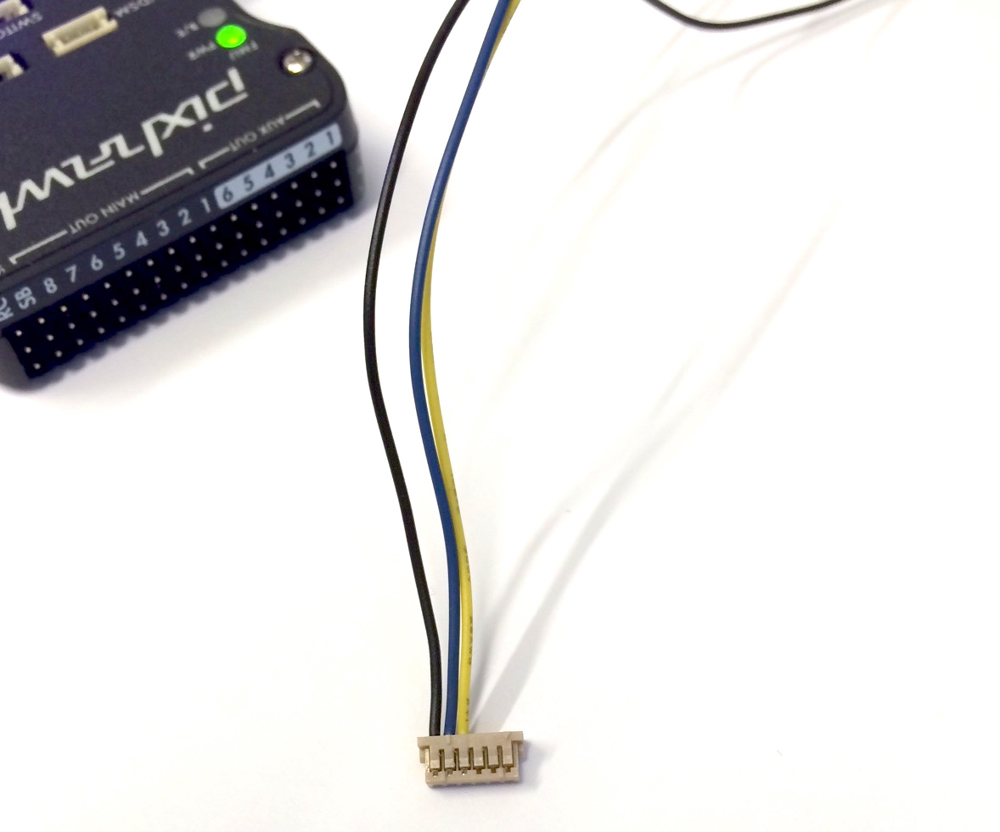

# PX4 시스템 콘솔

시스템 콘솔을 이용하면 시스템, 디버깅 출력, 시스템 부팅 순서를 확인할 수 있습니다. [Dronecode probe](http://nicadrone.com/index.php?id_product=61&controller=product)를 사용하는 것이 가장 편리한 방법이지만, 일반 FTDI 케이블도 이용할 수 있습니다.

## 시스템 콘솔 vs. 쉘

여러 쉘이 있지만 부팅정보(부팅시 자동실행되는 application)를 출력하는 콘솔이 바로 시스템 콘솔이면 이 콘솔은 1개만 존재합니다.

  * 시스템 콘솔 (첫번째 쉘): 하드웨어 시리얼 포트
  * 부가적인 쉘 : Pixhawk의 USB (예로 Mac OS에서 /dev/tty.usbmodem1)

> **Info**
> USB 쉘 : 몇 가지 간단한 명령 수행 혹은 application 테스트
> 쉘로 충분합니다. Mavlink 쉘을 이용할 수 있으며 아래 내용을 참고합니다.
> 하드웨어 시리얼 콘솔은 부트 디버깅용으로 필요하거나 USB를 MAVLink를
> [GCS](../qgc/README.md)) 연결하는데 사용해야하는 경우에만 필요합니다.

## Snapdragon Flight: 콘솔 연결하기

개발자 키트에는 콘솔에 연결할 수 있는 3핀짜리 브레이크아웃 보드가 들어 있습니다. 동봉된 FTDI 케이블을 헤더에 연결하고 브레이브아웃 보드를 확장 커넥터에 연결합니다.

## Pixracer / Pixhawk v3: 콘솔 연결하기

6-pos JST SH 1:1 케이블을 Dronecode probe에 연결하거나 케이블의 개별 핀을 FTDI 케이블에 아래와 같이 연결 :

| Pixracer / Pixhawk v3  |         | FTDI    |        |
| -- | -- | -- | -- |
|1         | +5V (red)     |         | N/C    |
|2         | UART7 Tx      | 5       | FTDI RX (yellow)  |
|3         | UART7 Rx      | 4       | FTDI TX (orange)  |
|4         | SWDIO      |         | N/C   |
|5         | SWCLK      |         | N/C   |
|6         | GND     | 1       | FTDI GND (black)   |

## Pixhawk v1: 콘솔 연결하기

시스템 콘솔은 Dronecode probe나 an FTDI 케이블을 통해서 접근 가능합니다. 두가지 옵션 모두 아래 섹션에서 설명합니다.

### Dronecode Probe를 통해서 연결하기

[Dronecode probe](http://nicadrone.com/index.php?id_product=65&controller=product)에 있는 6-pos DF13 1:1 케이블을 Pixhawk의 SERIAL4/5 포트에 연결합니다.


### FTDI 3.3V 케이블을 통해 연결하기

Dronecode probe가 없는 경우 FTDI 3.3V (Digi-Key: [768-1015-ND](http://www.digikey.com/product-detail/en/TTL-232R-3V3/768-1015-ND/1836393))도 잘 동작합니다.

| Pixhawk 1/2  |         | FTDI    |        |
| -- | -- | -- | -- |
|1         | +5V (red)     |         | N/C    |
|2         | S4 Tx      |         | N/C   |
|3         | S4 Rx      |         | N/C   |
|4         | S5 Tx      | 5       | FTDI RX (yellow)   |
|5         | S5 Rx      | 4       | FTDI TX (orange)   |
|6         | GND     | 1       | FTDI GND (black)   |

커넥터 핀아웃은 아래와 같습니다.



연결을 마치면 아래와 같습니다.


## 콘솔 열기

콘솔 연결이 완료되면, 여러분이 원하는 기본 시리얼 포트 도구를 사용할 수 있습니다. 기본 도구들은 아래와 같습니다. :

### Linux / Mac OS: Screen

Ubuntu에서 screen을 설치합니다. (Mac OS에는 이미 설치되어 있음):

<div class="host-code"></div>

```bash
sudo apt-get install screen
```

  * 시리얼: Pixhawk v1 / Pixracer는 57600 baud 사용
  * 시리얼: Snapdragon Flight는 115200 baud 사용

screen로 연결할때 BAUDRATE baud, 8 data bits, 1 stop bit를 지정합니다. (`ls /dev/tty*`을 사용해서 USB 장치의 장/탈착 변경을 확인) 일반적으로 Linux에서는 `/dev/ttyUSB0`와 `/dev/ttyACM0`라는 이름을, Mac OS에서는 `/dev/tty.usbserial-ABCBD` 이름을 사용합니다.

<div class="host-code"></div>

```bash
screen /dev/ttyXXX BAUDRATE 8N1
```

### Windows: PuTTY

[PuTTY](http://www.chiark.greenend.org.uk/~sgtatham/putty/download.html) 다운받아 실행합니다.

'serial connection'를 선택하고 포트 파라미터를 다음과 같이 설정 :

  * 57600 baud다
  * 8 data bits
  * 1 stop bit

## 콘솔에서 시작하기

`ls`를 입력하면 로컬 파일 시스템을 볼 수 있습니다. `free`를 입력하면 남은 RAM 용량을 확인할 수 있습니다. 콘솔은 보드에 전원이 들어올때 시스템 부팅 로그를 보여줍니다.

```bash
nsh> ls
nsh> free
```

## MAVLink Shell

NuttX기반 시스템 (Pixhawk, Pixracer, ...)에 대해서 nsh 콘솔로도 mavlink로 접근이 가능합니다. 시리얼 링크나 WiFi (UDP/TCP)를 통해 동작합니다. QGC가 실행중이지 아니라는 것을 확인하고, 쉘을 시작합니다.(예로 `./Tools/mavlink_shell.py /dev/ttyACM0`) 사용 가능한 파라미터를 볼려면 `-h`을 사용합니다. 여러분은 먼저 `sudo pip install pymavlink pyserial`로 관련 프로그램을 설치해야할 수도 있습니다.

# Snapdragon DSP 콘솔

usb로 Snapdragon 보드에 연결한 경우, px4 쉘에 접근할 수 있습니다. DSP쪽(QuRT)와 연동은 `qshell` posix app과 QuRT 컴패니언으로 활성화시킵니다.

USB로 Snapdragon에 연결해서 mini-dm을 열어서 DSP의 출력을 확인합니다. :
```
${HEXAGON_SDK_ROOT}/tools/debug/mini-dm/Linux_Debug/mini-dm
```

참고: 대안으로 특별히 Mac에서는 [nano-dm](https://github.com/kevinmehall/nano-dm)을 사용할 수 있습니다.

linaro쪽에서 main app을 실행 :
```
cd /home/linaro
./px4 px4.config
```

다음 문법을 이용하면 linaro 쉘에서 DSP로 올라간 모든 app을 사용할 수 있습니다. :
```
pxh> qshell command [args ...]
```

예제로 사용가능한 QuRT app 보기 :
```
pxh> qshell list_tasks
```

실행한 명령의 출력은 minidm에 표시됩니다.
