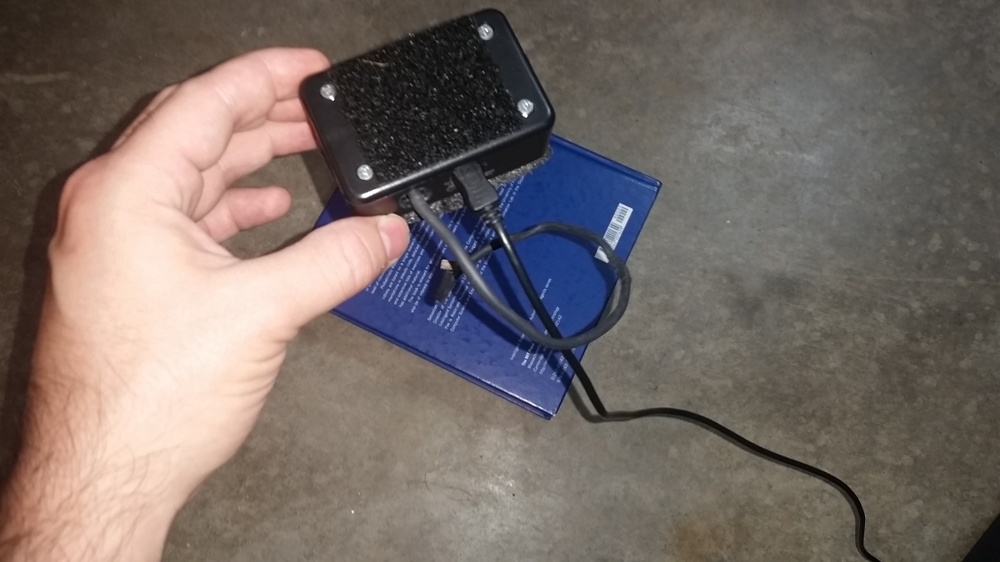
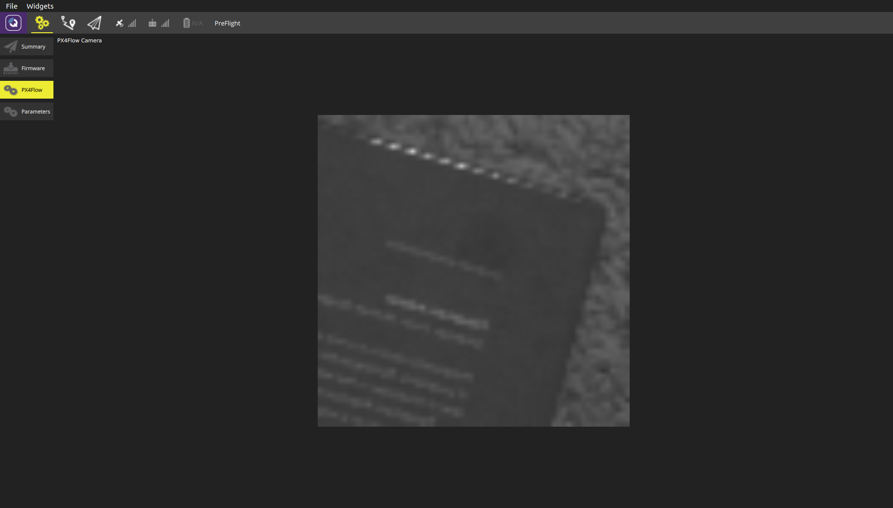

# Optical Flow Outdoors
----------------------------------------------------

This page shows you how to set up the PX4Flow for position estimation and autonomous flight outdoors. Using a LIDAR device is not necessary, but LIDAR does improve performance.

## Selecting LPE Estimator
--------------------------------------------------------

The only estimator that is tested to work with optical flow based autonmous flight outdoors is, LPE.

Use the `SYS_MC_EST_GROUP = 1` parameter to select the estimator and then reboot.

## Hardware
--------------------------------------------------------

*Figure 1: Mounting Coordinate Frame (relevant to parameters below)*

*Figure 2: PX4Flow optical flow sensor (camera and sonar)*

The PX4Flow has to point towards the ground and can be connected using the I2C port on the pixhawk. For best performance make sure the PX4Flow is attached at a good position and is not exposed to vibration. (preferably on the down side of the quad-rotor).

**Note: The default orientation is that the PX4Flow sonar side (+Y on flow) be pointed toward +X on the vehicle (forward). If it is not, you will need to set SENS_FLOW_ROT accordingly.**

*Figure 3: Lidar Lite*

Several LIDAR options exist including the Lidar-Lite (not currently manufacutured) and the sf10a: [sf10a](http://www.lightware.co.za/shop/en/drone-altimeters/33-sf10a.html). For the connection of the LIDAR-Lite please refer to [this](https://pixhawk.org/peripherals/rangefinder?s[]=lidar) page. The sf10a can be connected using a serial cable.

*Figure: PX4Flow/ Lidar-Lite mounting DJI F450*

*Figure: This Iris+ has a PX4Flow attached without a LIDAR, this works with the LPE estimator.*

*Figure: A weather-proof case was constructed for this flow unit. Foam is also used to surround the sonar to reduce prop noise read by the sonar and help protect the camera lens from crashes.*

### Focusing Camera

In order to ensure good optical flow quality, it is important to focus the camera on the PX4Flow to the desired height of flight. To focus the camera, put an object with text on (e. g. a book) and plug in the PX4Flow into usb and run QGroundControl. Under the settings menu, select the PX4Flow and you should see a camera image. Focus the lens by unscrewing the set screw and loosening and tightening the lens to find where it is in focus.

**Note: If you fly above 3m, the camera will be focused at infinity and won't need to be changed for higher flight.**

*Figure: Use a text book to focus the flow camera at the height you want to fly, typically 1-3 meters. Above 3 meters the camera should be focused at infinity and work for all higher altitudes.*

*Figure: The px4flow interface in QGroundControl that can be used for focusing the camera*

### Sensor Parameters

All the parameters can be changed in QGroundControl
* SENS_EN_LL40LS
	Set to 1 to enable lidar-lite distance measurements
* SENS_EN_SF0X
	Set to 1 to enable lightware distance measurements (e.g. sf02 and sf10a)

## Local Position Estimator (LPE)
--------------------------------------------------------

LPE is an Extended Kalman Filter based estimator for position and velocity states. It uses inertial navigation and is similar to the INAV estimator below but it dynamically calculates the Kalman gain based on the state covariance. It also is capable of detecting faults, which is beneficial for sensors like sonar which can return invalid reads over soft surfaces.

### Flight Video Outdoor
https://www.youtube.com/watch?v=Ttfq0-2K434 

Below is a plot of the autonomous mission from the outdoor flight video above using optical flow. GPS is not used to estimate the vehicle position but is plotted for a ground truth comparison. The offset between the GPS and flow data is due to the initialization of the estimator from user error on where it was placed. The initial placement is assumed to be at LPE_LAT and LPE_LON (described below).

*Figure 4: LPE based autonomous mission with optical flow and sonar*

### Parameters

The local position estimator will automatically fuse LIDAR and optical flow data when the sensors are plugged in.

* LPE_FLOW_OFF_Z - This is the offset of the optical flow camera from the center of mass of the vehicle. This measures positive down and defaults to zero. This can be left zero for most typical configurations where the z offset is negligible.
* LPE_FLW_XY - Flow standard deviation in meters.
* LPW_FLW_QMIN - Minimum flow quality to accept measurement.
* LPE_SNR_Z -Sonar standard deviation in meters.
* LPE_SNR_OFF_Z - Offset of sonar sensor from center of mass.
* LPE_LDR_Z - Lidar standard deviation in meters.
* LPE_LDR_Z_OFF -Offset of lidar from center of mass.
* LPE_GPS_ON - You won't be able to fly without GPS if LPE_GPS_ON is set to 1. You must disable it or it will wait for GPS altitude to initialize position. This is so that GPS altitude will take precedence over baro altitude if GPS is available.

**NOTE: LPE_GPS_ON must be set to 0 to enable flight without GPS **

### Autonomous Flight Parameters

*Tell the vehicle where it is in the world*

* LPE_LAT - The latitude associated with the (0,0) coordinate in the local frame.
* LPE_LON - The longitude associated with the (0,0) coordinate in the local frame.

*Make the vehicle keep a low altitude and slow speed*

* MPC_ALT_MODE - Set this to 1 to enable terrain follow
* LPE_T_Z - This is the terrain process noise. If your environment is hilly, set it to 0.1, if it is a flat parking lot etc. set it to 0.01.
* MPC_XY_VEL_MAX - Set this to 2 to limit leaning
* MPC_XY_P - Decrease this to around 0.5 to limit leaning
* MIS_TAKEOFF_ALT - Set this to 2 meters to allow low altitude takeoffs.

*Waypoints*

* Create waypoints with altitude 3 meters or below.
* Do not create flight plans with extremely long distance, expect about 1m drift / 100 m of flight.

**Note: Before your first auto flight, walk the vehicle manually through the flight with the flow sensor to make sure it will trace the path you expect.**