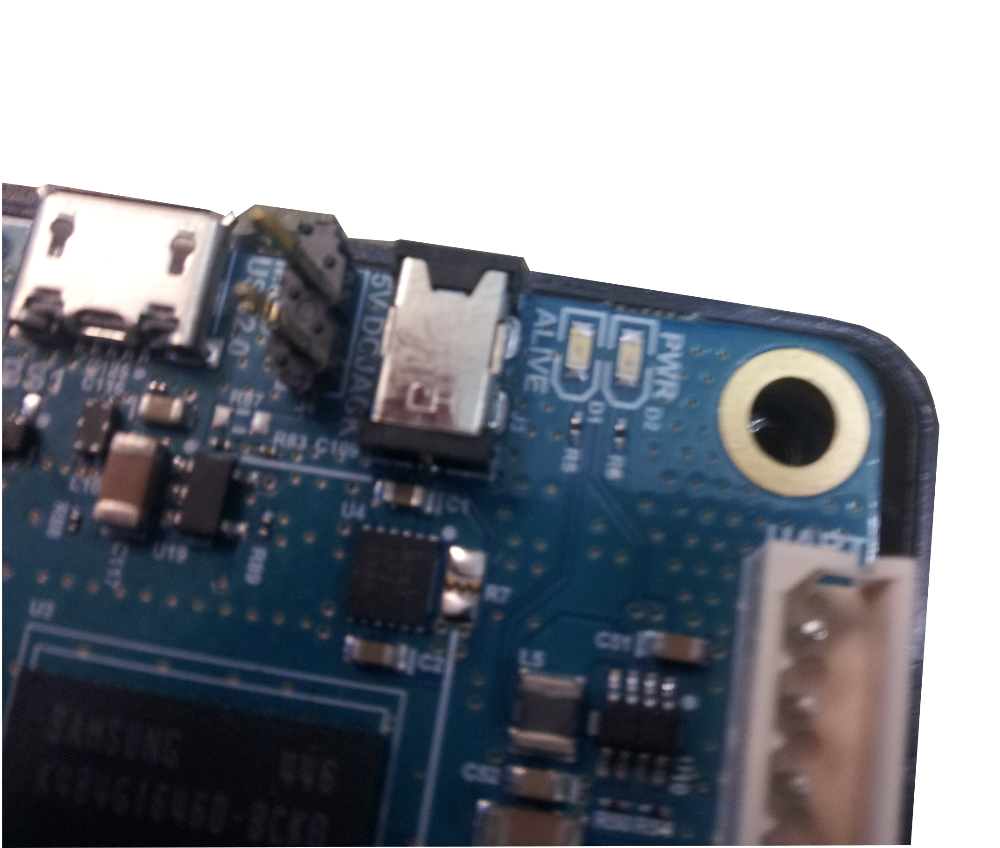

# QGC的视频流
官网英文原文地址：http://dev.px4.io/advanced-videostreaming-qgc.html

这页面说明如何建立一台带一个镜头(Logitech C920) 的配套工业计算机Odroid C1  ，视频流通过Odroid C1（ODROID　C1）传输到网络计算机和在计算机上的QDC应用显示运行。 


整个硬件设置如下所示。 它由以下几个部分组成：

- Odroid C1
- 罗技镜头 C920
- WiFi module TP-LINK TL-WN722N


## 安装Odroid C1　Linux的环境

按照Odroid C1安装教程，安装Ubuntu 14.04)的运行环境, 在本教程中 [Odroid C1 tutorial](https://pixhawk.org/peripherals/onboard_computers/odroid_c1). 还说明如何用串口电缆接入Odroid C1（ODROID　C1 ）以及如何建立以太网连接。

## 建立连接替代电源

Odroid C1 能够通过5V DC电源插孔。如果ODROID是安装在无人机的，建议采用焊接两引脚通孔焊接5V直流插孔固定的方法如下图所示。 [method](https://learn.sparkfun.com/tutorials/how-to-solder---through-hole-soldering) 。 电源的使用是连接到通过跳线(红色如上面的图片) 的ODROID　C1 的直流电压（5 V）和接地电路连接在示例设置中Odroid C1 的跳线地线针脚上 (如上图黑线)。 




## 启用ODROID C1 WiFi连接 

在这本教程的WiFi模块采用TP-LINK tl-wn722n。 要启用的ODROID C1的WiFi连接，按照 [ODROID C1教程](https://pixhawk.org/peripherals/onboard_computers/odroid_c1) 的步骤描述用WiFi天线建立网络连接。 

## 配置WiFi接入点 

本节说明如何设置ODROID C1一个数据接入点。内容在原有 [教程](https://pixhawk.org/peripherals/onboard_computers/access_point) 上作一些小的改进。 启动视频流从摄像头的通过到地面站，运行在计算机则不需要遵循本节。然而，这里表示是因为建立ODROID C1像允许以一个独立的方式使用系统的数据接入点。TP-LINK TL-WN722N使用像WiFi模块。在随后的步骤它是假定指定名称的ODROID系列C1 WLAN 0到你的WiFi模块。改变WLAN 0的所有事件如果相应接口不同（如wlan1）。 

### 机载计算机作为接入点

在深入的解释更多，你可以看看 [RPI-Wireless-Hotspot](http://elinux.org/RPI-Wireless-Hotspot)

安装必要的软件

<div class="host-code"></div>

```bash
sudo apt-get install hostapd udhcpd
```

配置 DHCP. 编辑文件 `/etc/udhcpd.conf`

<div class="host-code"></div>

```bash
start 192.168.2.100 # This is the range of IPs that the hostspot will give to client devices.
end 192.168.2.200
interface wlan0 # The device uDHCP listens on.
remaining yes
opt dns 8.8.8.8 4.2.2.2 # The DNS servers client devices will use (if routing through the ethernet link).
opt subnet 255.255.255.0
opt router 192.168.2.1 # The Onboard Computer's IP address on wlan0 which we will set up shortly.
opt lease 864000 # 10 day DHCP lease time in seconds
```

所有其他的“选择”条目应该被禁用或如果你知道你在做如何配置正确。

编辑文件 `/etc/default/udhcpd` 和修改行:

<div class="host-code"></div>

```bash
DHCPD_ENABLED="no"
```

为

<div class="host-code"></div>

```bash
#DHCPD_ENABLED="no"
```

您需要给机载计算机一个静态的IP地址 编辑文件 `/etc/network/interfaces` 和代替行 `iface wlan0 inet dhcp` (or `iface wlan0 inet manual`) 为:

```sh
auto wlan0
iface wlan0 inet static
address 192.168.2.1
netmask 255.255.255.0
network 192.168.2.0
broadcast 192.168.2.255
wireless-power off
```

停用原有（无线客户端）自动配置。 修改行 (注意：它们可能不会全部在同一个地方，也许是分开的，甚至可能根本不存在):

<div class="host-code"></div>

```sh
allow-hotplug wlan0
wpa-roam /etc/wpa_supplicant/wpa_supplicant.conf
iface default inet dhcp
```

为:

<div class="host-code"></div>

```sh
#allow-hotplug wlan0
#wpa-roam /etc/wpa_supplicant/wpa_supplicant.conf
#iface default inet dhcp
```

如果你遵循 [Odroid C1 教程](https://pixhawk.org/peripherals/onboard_computers/odroid_c1) 建立无线网络连接， 您已经创建的文件 `/etc/network/intefaces.d/wlan0`. 请注释在该文件中的所有行，使得这些配置不再有任何效果。

配置 HostAPD: 创建 WPA-secured 网络, 编辑文件 `/etc/hostapd/hostapd.conf` (如果它不存在就新创建) 和 加上跟随行: 

```
auth_algs=1
channel=6            # Channel to use
hw_mode=g
ieee80211n=1          # 802.11n assuming your device supports it
ignore_broadcast_ssid=0
interface=wlan0
wpa=2
wpa_key_mgmt=WPA-PSK
wpa_pairwise=TKIP
rsn_pairwise=CCMP
# Change the to the proper driver
driver=nl80211
# Change these to something else if you want
ssid=OdroidC1
wpa_passphrase=QGroundControl

```

改变 `ssid=`, `channel=`, 和 `wpa_passphrase=` 你选的值. SSID 是传播到其他设配热点名, 通道是热点运行在什么频率，wpa_passphrase是无线网络密码。为更多的选项看到文件。  `/usr/share/doc/hostapd/examples/hostapd.conf.gz`.
寻找一个在这个区域没有使用的通道， 你可以使用的工具如wavemon。 

E编辑文件 `/etc/default/hostapd` 修改行:

<div class="host-code"></div>

```
#DAEMON_CONF=""
```

为:

```
DAEMON_CONF="/etc/hostapd/hostapd.conf"
```

你的机载电脑现在应该是主持一个无线热点。 要获得启动启动的热点，运行这些额外的命令： 

<div class="host-code"></div>

```
sudo update-rc.d hostapd enable
sudo update-rc.d udhcpd enable
```

作为一个数据接入点要有足够同时接入机载计算机和允许你的地面站连接. 如果你真的想让它作为一个真正的接入点 (WiFi机载计算机的以太网连接路由的流), 我们需要配置路由和网络地址翻译（NAT）。启用内核中的IP转发： 

<div class="host-code"></div>

```sh
sudo sh -c "echo 1 > /proc/sys/net/ipv4/ip_forward"
```

启动内核，运行下面命令:

<div class="host-code"></div>

```sh
sudo iptables -t nat -A POSTROUTING -o eth0 -j MASQUERADE
sudo iptables -A FORWARD -i eth0 -o wlan0 -m state --state RELATED,ESTABLISHED -j ACCEPT
sudo iptables -A FORWARD -i wlan0 -o eth0 -j ACCEPT
```

调整参数, 运行下面命令:

<div class="host-code"></div>

```sh
sudo sh -c "iptables-save > /etc/iptables.ipv4.nat"
```

编辑文件 /etc/network/interfaces 和在文件最下方加上这一行: 

<div class="host-code"></div>

```sh
up iptables-restore < /etc/iptables.ipv4.nat
```

# gstreamer 安装

在电脑上和Odroid C1 安装 gstreamer 包 和 启动流, 按照指令获取 [QGroundControl README](https://github.com/mavlink/qgroundcontrol/blob/master/src/VideoStreaming/README.md). 

如果你不能启动Odroid与uvch264s插件, 也可以尝试与v4l2src插件启动:

<div class="host-code"></div>

```sh
 gst-launch-1.0 v4l2src device=/dev/video0 ! video/x-h264,width=1920,height=1080,framerate=24/1 ! h264parse ! rtph264pay ! udpsink host=xxx.xxx.xxx.xxx port=5000
```

当 `xxx.xxx.xxx.xxx`  QGC地面站IP地址正在运行， 如果看到系统错误 `Permission denied`, 你可以下面这个命令 `sudo`。

如果一切正常，你应该看到在底部的左上角OGC视频流在飞行模式下screeenshot显示窗口。 


如果你点击了视频流，卫星地图将在整个背景左下角的显示和视频显示。

