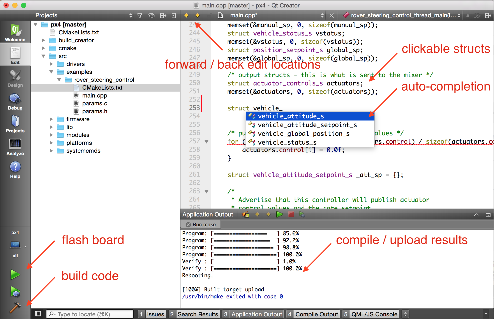

# 编译px４软件


PX4可以在控制台或者图形界面/IDE开发

## 在控制台编译
在去到图形界面或者IDE前，验证系统设置的正确性非常重要，因此打开控制台。在 OS X, 敲击 ⌘-space ，并搜索'terminal'。在Ubuntu，单击启动栏，搜索“terminal”（或者trl+alt+T）。在windows平台，在开始菜菜单找到px4文件夹，单击'PX4 Console'


终端在Home目录启动，我们默认去到'~/src/Firmware' 然后，克隆顶层资源库。有经验的开发者可以克隆自己的复制的[资源库](https://help.github.com/articles/fork-a-repo/) 

<div class="host-code"></div>

```sh
mkdir -p ~/src
cd ~/src
git clone https://github.com/PX4/Firmware.git
cd Firmware
git submodule update --init --recursive
cd ..
```


现在可以通过编译源代码来构建二进制文件。在直接使用硬件前，推荐先[进行仿真](../4_Simulation/basic_simulation.md)。喜欢在图形界面开发环境工作的用户也应该继续完成下面部分。


###基于NuttX / Pixhawk的硬件板

<div class="host-code"></div>

```sh
cd Firmware
make px4fmu-v2_default
```

注意到“make”是一个字符命令编译工具，“px4fmu-v2”是硬件/ardupilot版本，“default”是默认配置，所有的PX4编译目标遵循这个规则。 

成功编译的最后输出是这样的：

<div class="host-code"></div>

```sh
[100%] Linking CXX executable firmware_nuttx
[100%] Built target firmware_nuttx
Scanning dependencies of target build_firmware_px4fmu-v2
[100%] Generating nuttx-px4fmu-v2-default.px4
[100%] Built target build_firmware_px4fmu-v2
```

通过在命令后面添加‘upload’，编译的二进制程序就会通过USB上传到飞控硬件:

<div class="host-code"></div>

```sh
make px4fmu-v2_default upload
```

上传成功时输出情况如下：

<div class="host-code"></div>

```sh
Erase  : [====================] 100.0%
Program: [====================] 100.0%
Verify : [====================] 100.0%
Rebooting.

[100%] Built target upload
```

### Raspberry Pi 2 开发板


以下命令编译生成Raspbian（posix_pi2_release）版本的固件。


```sh
cd Firmware
make posix_rpi2_release # for cross-compiler build
```

"mainapp"可执行文件位于目录build_posix_rpi2_release/src/firmware/posix下。 将其复制到RPi（用你的RPi的IP或主机名替换YOUR_PI，关于如何访问你的RPi，查看[介绍](../5_Autopilot-Hardware/raspeberry_pi2.md#developer-quick-start))

然后使用以下命令设置你的RPi的IP（或主机名）：

```sh
export AUTOPILOT_HOST=192.168.X.X
```

并上传：

```sh
cd Firmware
make posix_rpi_cross upload # for cross-compiler build
```

然后，通过ssh连接并运行它（以root权限）：

```sh
sudo ./px4 px4.config
```

#### 本地构建


如果你要直接在Pi上编译，则需要在本地编译固件（posix_rpi_native）。

```sh
cd Firmware
make posix_rpi_native # for native build
```

“px4”可执行文件位于目录build_posix_rpi_native/src/firmware/posix中。直接运行：


```sh
sudo ./build_posix_rpi_native/src/firmware/posix/px4 ./posix-configs/rpi/px4.config
```

px4成功执行的情况如下：

```sh

______  __   __    ___
| ___ \ \ \ / /   /   |
| |_/ /  \ V /   / /| |
|  __/   /   \  / /_| |
| |     / /^\ \ \___  |
\_|     \/   \/     |_/

px4 starting.


pxh>
```

#### 自启动

要自动启动px4，在`exit 0`之前，请将以下内容添加到文件`/etc/rc.local`中（如果使用本机构建，请相应调整）：

```
cd /home/pi && ./px4 -d px4.config > px4.log
```


### Parrot Bebop

支持的Bebop是非常早期的版本，使用前请特别注意。

#### 编译
```sh
cd Firmware
make posix_bebop_default
```

打开你的Bebop，通过Bebop的wifi连接你的主机。 然后，按下电源按钮四次以启用ADB并启动telnet守护程序。

```sh
make posix_bebop_default upload
```

以上操作会将PX4 mainapp上传到/usr/bin并创建文件/home/root/parameters（如果尚未存在）。 此外，我们需要Bebop的mixer文件和px4.config。 当前这两个文件必须使用以下命令手动复制。

```sh
adb connect 192.168.42.1:9050
adb push ROMFS/px4fmu_common/mixers/bebop.main.mix /home/root
adb push posix-configs/bebop/px4.config /home/root
adb disconnect
```

#### 运行

连接Bebop的wifi，然后按电源按钮四次。 接下来，通过telnet或adb shell与Bebop连接，并运行以下命令。

```sh
telnet 192.168.42.1
```

通过以下命令关闭Bebop的所有驱动。

```sh
kk
```

启动PX4 mainapp：

```sh
px4 /home/root/px4.config
```

为了飞行Bebop，将操纵杆设备与主机连接并启动QGroundControl。 Bebop和操纵杆都应该被识别。按照说明校准传感器并设置操纵杆设备。

#### 自启动


要使启动时在Bebop上自动启动PX4，请修改init脚本`/etc/init.d/rcS_mode_default`。 添加下行：

```
DragonStarter.sh -out2null &
```

替换为：

```
px4 -d /home/root/px4.config > /home/root/px4.log
```

通过按电源按钮4次启用adb服务器，并按照上述方式连接到adb服务器：


```sh
adb connect 192.168.42.1:9050
```

将系统分区重新挂载为可写：
```sh
adb shell mount -o remount,rw /
```
为了避免手动配置文件，可以使用下面链接： https://gist.github.com/mhkabir/b0433f0651f006e3c7ac4e1cbd83f1e8

保存原来的，并将其推送到Bebop

```sh
adb shell cp /etc/init.d/rcS_mode_default /etc/init.d/rcS_mode_default_backup
adb push rcS_mode_default /etc/init.d/
```

同步并重启
```sh
adb shell sync
adb shell reboot
```

### 基于QuRT / Snapdragon的开发板

#### 编译

以下命令编译Linux和DSP端的固件。 两个可执行机构通过[muORB](advanced-uorb.md)进行通信。

```sh
cd Firmware
make eagle_default
```

要将SW加载到设备上，通过USB数据线进行连接，并确保设备已启动。 在新的终端窗口中运行：

```sh
adb shell
```

返回上一个终端并上传：

```sh
make eagle_default upload
```


请注意，这也将复制（并覆盖）[mainapp.config](https://github.com/PX4/Firmware/blob/master/posix-configs/eagle/flight/mainapp.config)和[px4.config](https://github.com/PX4/Firmware/blob/master/posix-configs/eagle/flight/px4.config)这两个配置文件到设备。 如果你要直接编辑启动脚本，文件路径分别为/usr/share/data/adsp/px4.config和/home/linaro/mainapp.config。

当前需要手动复制mixer

```sh
adb push ROMFS/px4fmu_common/mixers/quad_x.main.mix  /usr/share/data/adsp
```

#### 运行

运行DSP调试监视器：

```sh
${HEXAGON_SDK_ROOT}/tools/debug/mini-dm/Linux_Debug/mini-dm
```

注意：如果是在Mac上，你也可以使用[nano-dm](https://github.com/kevinmehall/nano-dm)。 

回到ADB shell并运行px4：


```sh
cd /home/linaro
./px4 mainapp.config
```

请注意，只要断开USB数据线（或者ssh会话断开连接），px4就会停止。 如果要飞行，你应该在启动后使px4自动启动。

#### 自启动


要在Snapdragon启动时一直运行px4，可以将启动添加到`rc.local`中： 或者直接编辑文件`/etc/rc.local`：


```sh
adb shell
vim /etc/rc.local
```

或将文件复制到你的电脑，在本地进行编辑，然后将其复制回来：

```sh
adb pull /etc/rc.local
gedit rc.local
adb push rc.local /etc/rc.local
```

对于自动启动，在 `exit 0`之前添加以下行：

```sh
(cd /home/linaro && ./px4 mainapp.config > mainapp.log)

exit 0
```

确保`rc.local`是可执行的：

```sh
adb shell
chmod +x /etc/rc.local
```

然后重新启动Snapdragon：

```sh
adb reboot
```


##图形IDE界面下编译
PX4 支持Qt Creator, Eclipse 和Sublime Text三种集成式开发环境。  Qt Creator是最友好的开发环境，所以被是唯一官方支持的IDE。除非资深的Eclipse 或Sublime开发者，否则一般不推荐使用Eclipse或Sublime进行二次开发。硬件底层开发可以在 [Eclipse project](https://github.com/PX4/Firmware/blob/master/.project) 和 a [Sublime project](https://github.com/PX4/Firmware/blob/master/Firmware.sublime-project) 找到源码。


<video id="my-video" class="video-js" controls preload="auto" width="100%" 
poster="../pictures/diagrams/qtcreator.PNG" data-setup='{"aspectRatio":"16:9"}'>
  <source src="http://7xvob5.com1.z0.glb.clouddn.com/PX4%20Flight%20Stack%20Build%20Experience.mp4" type='video/mp4' >
  <p class="vjs-no-js">
    To view this video please enable JavaScript, and consider upgrading to a web browser that
    <a href="http://videojs.com/html5-video-support/" target="_blank">supports HTML5 video</a>
  </p>
</video>


## Qt Creator 功能
Qt creator 提供单击选择变量、代码自动补全、代码编译和固件上传等功能。



### Linux 平台的 Qt Creator 

在启动Qt creator之前,  需要先创建[工程文件](https://cmake.org/Wiki/CMake_Generator_Specific_Information#Code::Blocks_Generator) :

<div class="host-code"></div>

```sh
cd ~/src/Firmware
mkdir ../Firmware-build
cd ../Firmware-build
cmake ../Firmware -G "CodeBlocks - Unix Makefiles" -DCONFIG=nuttx_px4fmu-v2_default
```
接着启动Qt creator（如果系统没安装Qt Creator 百度一下linux下安装Qt Creator，然后再启动Qt Creator）并加载 Firmware 根目录下 CMakeLists.txt 文件，步骤：点击工具栏 File -> Open File or Project -> Select the CMakeLists.txt file 。
如果加载提示ninja没有安装，请按照“高级Linux”章节进行ninja编译工具的安装，安装完成后，log out（登出）并log in（登入）。

加载了文件后，点击左侧projects按钮，在run onfiguration栏选择'custom executable',在executable 栏里输入'make'， argument栏输入 'upload'，将‘play’按钮配置成运行工程。


### Windows平台的 Qt Creator 

<aside class="todo">
Windows平台下的Qt Creator开发目前也没经过详细测试。
</aside>

### Mac OS 平台的  Qt Creator 

启动 Qt Creator 之前，需要先创建 [project file](https://cmake.org/Wiki/CMake_Generator_Specific_Information#Code::Blocks_Generator) ：

<div class="host-code"></div>

```sh
cd ~/src/Firmware
mkdir build_creator
cd build_creator
cmake .. -G "CodeBlocks - Unix Makefiles"
```

完成上述步骤以后，启动 Qt Creator, 完成下面视频中的步骤，就可以进行工程文件的编译了。


<video id="my-video" class="video-js" controls preload="auto" width="100%" 
poster="../pictures/diagrams/macQt.PNG" data-setup='{"aspectRatio":"16:9"}'>
  <source src="http://7xvob5.com2.z0.glb.qiniucdn.com/PX4%20Cmake%20Project%20Setup%20on%20Mac%20OS.mp4" type='video/mp4' >
  <p class="vjs-no-js">
    To view this video please enable JavaScript, and consider upgrading to a web browser that
    <a href="http://videojs.com/html5-video-support/" target="_blank">supports HTML5 video</a>
  </p>
</video>

