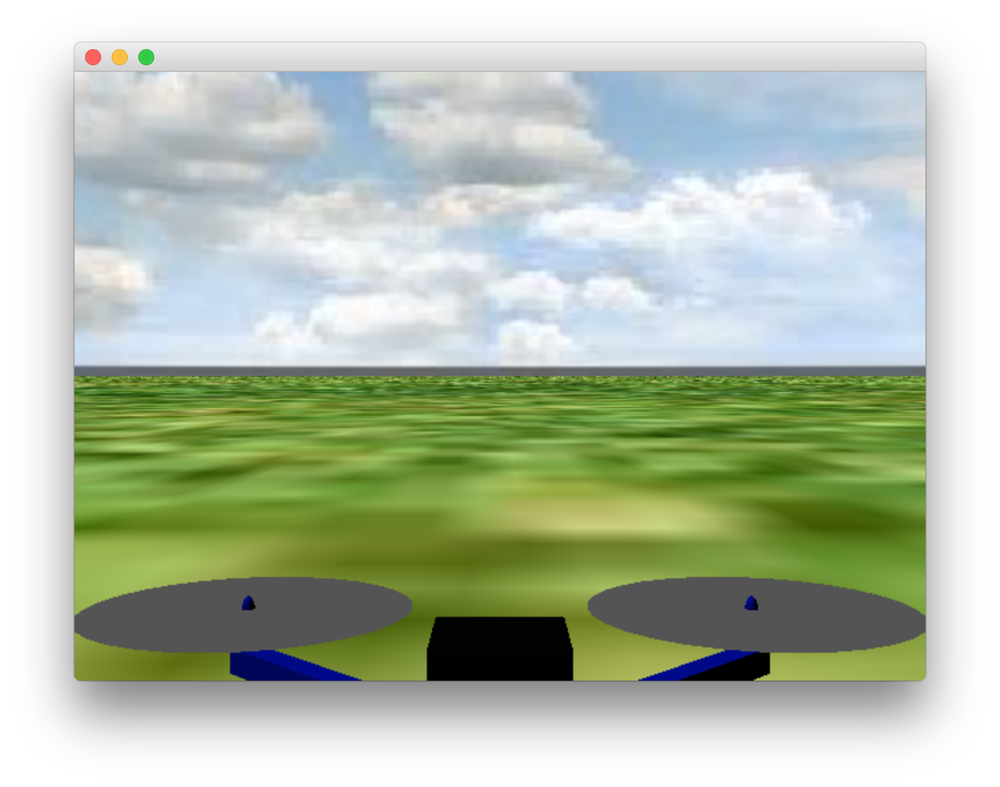

# 软件在环仿真 (SITL) 


软件在环仿真是在主机上运行一个完整的系统并模拟自驾仪。它通过本地网络连接到仿真器。 设置成如下的形式：


graph LR;
  Simulator-->MAVLink;
  MAVLink-->SITL;


## 运行SITL

在确保[仿真必备条件](../setup/dev_env.md) 已经安装在系统上之后, 就可以直接启动 : 使用便捷的`make target`可以编译POSIX的主构建，并运行仿真 .

<div class="host-code"></div>

```sh
make posix_sitl_default jmavsim
```

这将启动PX4 shell:

```sh
[init] shell id: 140735313310464
[init] task name: mainapp

______  __   __    ___ 
| ___ \ \ \ / /   /   |
| |_/ /  \ V /   / /| |
|  __/   /   \  / /_| |
| |     / /^\ \ \___  |
\_|     \/   \/     |_/

Ready to fly.


pxh>
```

## 重要的文件

- 启动脚本文件在 [posix-configs/SITL/init](https://github.com/PX4/Firmware/tree/master/posix-configs/SITL/init) 文件夹中并被命名为`rcS_SIM_AIRFRAME`, 默认是 `rcS_jmavsim_iris`.
- 系统启动文件 (相当于 `/` 被视为) 位于构建文件夹内部 : `build_posix_sitl_default/src/firmware/posix/rootfs/`

## 起飞

添加一个带[jMAVSim](http://github.com/PX4/jMAVSim.git)仿真器的3D视觉窗口：



一旦完成初始化，该系统将打印home的位置 (`telem> home: 55.7533950, 37.6254270, -0.00`). 你能够通过输入以下指令让其起飞：

```sh
pxh> commander takeoff
```


> **提示** 地面站(QGC)支持虚拟操纵杆或拇指操纵杆。要使用手动输入，把系统打在手动飞行模式(e.g. POSCTL, 位置控制)。从地面站QGC参考菜单启动拇指操纵杆。


## Wifi无人机的仿真

现有一个特殊的任务：对通过局域网WiFi连接的无人机进行仿真

<div class="host-code"></div>

```sh
make broadcast jmavsim
```

如同一个真正的无人机会做的一样，仿真器也会广播无人机在局域网中的地址

## 扩展和自定义

为了扩展或自定义仿真界面，可以编辑 `Tools/jMAVSim`文件夹下的文件。能够通过 Github上的[jMAVSim repository](https://github.com/px4/jMAVSim)取得原码.


> **提示** 构建系统强制检查所有依赖的子模块，包括仿真软件。虽然这些文件夹中文件的改变不会被覆盖，但当这些改变被提交的时候子模块需要在固件库中以新的hash注册。为此，输入 `git add Tools/jMAVSim`进行提交。这样仿真软件的GIT hash就会被更新。

## 连接ROS

这个仿真能够[连接到ROS上](../simulation/ros_interface.md)，其方法与将一个搭载真实的飞行器的板子连接到ROS上相同。
